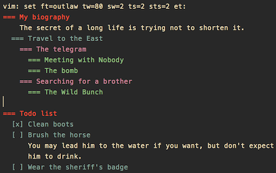

# Vim Outlaw: The Wanted Outliner!

Hi, I am Outlaw, and I am wanted.

I am wanted because I am an outliner, and although many outliners
are already available for Vim, I am different. Striving for the same
minimalist philosophy followed by plugins like
[Commentary](https://github.com/tpope/vim-commentary),
[Dirvish](https://github.com/justinmk/vim-dirvish) or
[Sneak](https://github.com/justinmk/vim-sneak), I do not try to
reinvent the wheel. The price on my head is about 130 LoC.

Here is a very simple outline which you may start playing with:

```
vim: set tw=80 sw=2 ts=2 sts=2 et ft=outlaw:
=== My biography
    The secret of a long life is trying not to shorten it.
  === Travel to the East
    === The telegram
      === Meeting with Nobody
      === The bomb
    === Searching for a brother
      === The Wild Bunch

=== Things to do
  [x] Clean boots
  [ ] Brush the horse
      You may lead him to the water if you want, but don't expect
      him to drink.
  [ ] Wear the sheriff's badge
```
which looks like this:



I interpret lines starting with `===`, `[x]`, `[-]` or `[ ]`,
followed by a space, as topics. Each topic must be on a single line.
The pattern defining a topic may be fully customized by setting
`g:outlaw_topic_mark`, shouldn't you like my admittedly biased
choice.

Topics may be indented to form a hierarchy or outline. I support up
to nineteen levels (ten are highlighted by default, see
`g:outlaw_levels`). I work with spaces or tabs, you choose (but do
not use both to indent different topics inside the same document!).

For me, everything that does not look like a topic (including blank
lines) is body text (notes). I couldn't care less about the format
or indentation of your notes: each block of body text always
belongs to the topic immediately before it. But don't call it a son
of a topic: you'd better think of body text as being at the same
level as the topic it belongs to (although its fold level may be set
to a different value using `gy`, so that it may be folded
independently: see also `g:outlaw_body_text_level`).

Notes are just plain text, but you may use `~~~` tags to embed any
configured filetype (see `g:outlaw_nested_ft`). If you don't like
`~~~`, the tag may be changed, too (see `g:outlaw_ft_tag`).

I let you jump through topics quickly: to the next or previous topic
(`<down>` and `<up>`), brother or cousin (`<c-j>` and `<c-k>`),
father or uncle (`-` or `+`). Press `<enter>` in Normal mode to
quickly add a new brother.

There's not much else you need to know about me. But if you want to
know all the details, see **:h outlaw.txt**.


